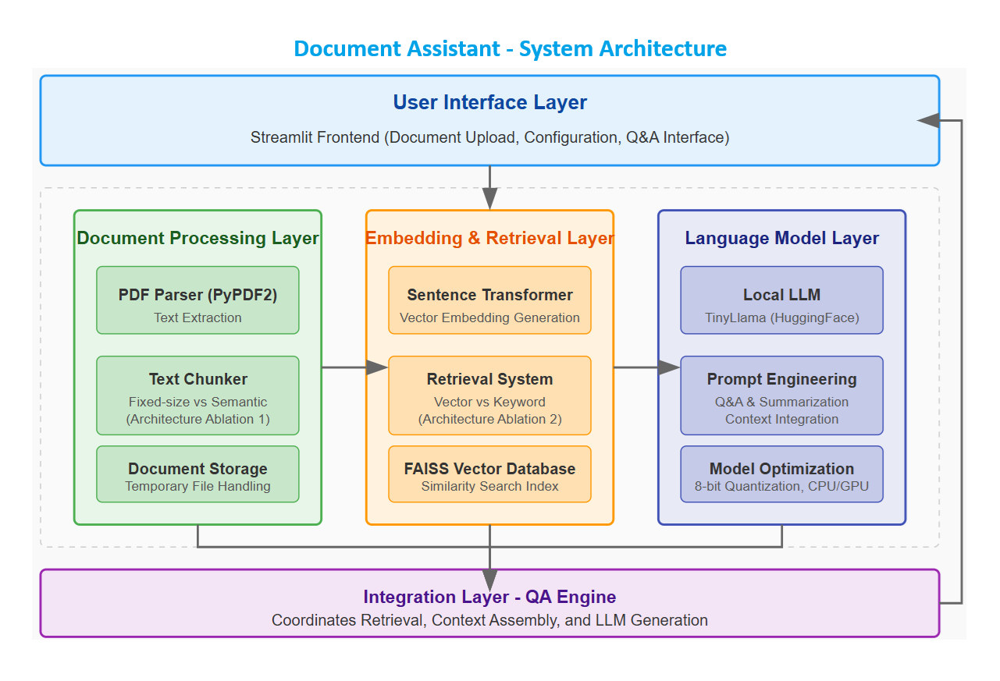

# Document Assistant

*This application was developed for an interview with CriticalRiver.*

Document Assistant is a Python application that analyzes contract documents and provides a Q&A interface, allowing users to ask questions about the document content and receive accurate answers.

## Features

- **Document Analysis**: Process and analyze PDF contracts
- **Q&A Capabilities**: Ask questions about the document and receive relevant answers
- **Document Summarization**: Generate concise summaries of contract documents
- **Interactive Interface**: User-friendly Streamlit interface for document upload and Q&A

## Architecture

The application follows a modular architecture with the following components:



### Components

1. **Document Processor**: Handles PDF parsing and text chunking
2. **Embeddings Manager**: Creates and manages vector representations of document chunks
3. **LLM Manager**: Interfaces with the local language model
4. **Q&A Engine**: Coordinates the retrieval and answering process
5. **Streamlit Frontend**: Provides the user interface

### Architecture Ablations

The application implements two key architecture ablations to compare different approaches:

1. **Document Chunking Strategy**:
   - **Fixed-size Chunking**: Splits the document into chunks of a fixed token count
   - **Semantic Chunking**: Splits the document based on semantic boundaries like paragraphs and sections
   - Recommendation: Use "semantic" for contract documents to preserve clause integrity

2. **Retrieval Method**:
   - **Vector Similarity**: Uses embeddings to find semantically similar content
   - **Keyword Matching**: Uses keyword frequency to retrieve relevant chunks
   - Recommendation: Use "vector" for legal documents to capture semantic relationships

## Getting Started

### Prerequisites

- Python 3.9 or 3.10 (recommended for best compatibility)
- Sufficient RAM for loading language models (at least 8GB recommended)
- GPU acceleration recommended but not required

### Installation

1. Clone the repository:
   ```
   git clone https://github.com/yourusername/document-assistant.git
   cd document-assistant
   ```

2. Create and activate a virtual environment (recommended):
   ```
   python -m venv venv
   source venv/bin/activate  # On Windows: venv\Scripts\activate
   ```

3. Install the dependencies:
   ```
   pip install -r requirements.txt
   ```

### Running the Application

1. Start the Streamlit application:
   ```
   streamlit run app.py
   ```

2. Open your web browser and navigate to the URL displayed in the terminal (typically `http://localhost:8501`)

3. Upload a contract document (PDF format)

4. Set the chunking strategy to "semantic" and retrieval method to "vector" in the sidebar

5. Click "Process Document" to analyze the document

6. Ask questions about the document using the text input field

## Compatibility Issues and Troubleshooting

Several compatibility issues may arise when running the application, particularly with newer Python versions:

### Python Version Compatibility

- Python 3.12 has compatibility issues with several ML libraries
- Recommended: Use Python 3.9 or 3.10 for best compatibility

### Common Issues and Solutions

1. **`langchain.text_splitter` Import Error**:
   - Error: `ImportError: Could not import langchain.text_splitter`
   - Solution: Update the import to `from langchain_text_splitters import RecursiveCharacterTextSplitter, TokenTextSplitter`

2. **Huggingface-hub Version Issues**:
   - Error: `ImportError: cannot import name 'cached_download' from 'huggingface_hub'`
   - Solution: Install specific versions:
     ```
     pip install huggingface-hub==0.16.4
     pip install sentence-transformers==2.2.2
     ```

3. **Transformers and Keras Compatibility**:
   - Error: `Failed to import transformers.modeling_tf_utils`
   - Solution: Install tf-keras package:
     ```
     pip install tf-keras
     ```

4. **Tiktoken Missing**:
   - Error: `ImportError: Could not import tiktoken python package`
   - Solution: Install tiktoken:
     ```
     pip install tiktoken
     ```

5. **Poor Document Processing Results**:
   - Symptom: Garbled summaries or irrelevant answers
   - Solution: Switch to "semantic" chunking and "vector" retrieval for better results with complex documents

### Creating a Clean Environment

If you encounter multiple issues, it's often best to create a fresh environment with specific package versions:

```bash
conda create -n doc_assistant python=3.10
conda activate doc_assistant

pip install PyPDF2==3.0.1
pip install langchain-text-splitters==0.0.1
pip install sentence-transformers==2.2.2
pip install huggingface-hub==0.16.4
pip install faiss-cpu==1.7.4
pip install transformers==4.31.0
pip install torch==2.0.1
pip install streamlit==1.24.0
pip install tiktoken
pip install tf-keras
```

## Project Structure

```
document-assistant/
├── app.py                  # Streamlit frontend
├── src/
│   ├── __init__.py
│   ├── document_processor.py   # Document parsing and chunking
│   ├── embeddings.py       # Vector embeddings management
│   ├── llm_manager.py      # LLM integration
│   ├── qa_engine.py        # Q&A functionality
│   └── utils.py            # Helper functions
├── tests/
│   ├── test_document_processor.py
│   ├── test_embeddings.py
│   ├── test_llm_manager.py
│   └── test_qa_engine.py
├── data/
│   └── processed/          # Directory for processed documents
├── requirements.txt        # Dependencies
└── README.md               # Documentation
```

## Technical Choices

### Local LLM Selection

The application uses TinyLlama (1.1B parameters) by default for faster loading and less resource consumption, but can be configured to use larger models for improved performance.

### Document Processing Pipeline

1. PDF text extraction using PyPDF2
2. Text chunking using either fixed-size or semantic strategies
3. Embedding generation using sentence-transformers
4. Vector indexing with FAISS for efficient retrieval

## Limitations and Future Improvements

- Currently only supports PDF documents
- Processing large documents can be memory-intensive
- Local LLMs have performance limitations compared to cloud-based alternatives
- Future improvements could include:
  - Support for more document formats (DOCX, TXT, etc.)
  - Improved chunking strategies
  - Integration with more advanced local models
  - Caching mechanisms to improve performance

## Test Suite

The project includes unit tests for all major components:
- These tests verify the functionality of each module
- Not required to run the application, but helpful for verifying implementation
- Satisfies the project requirement for at least 5 unit tests
- Run tests with `pytest` if needed

## License

This project is open source and available under the MIT License.

## Acknowledgments

- HuggingFace for providing access to open-source language models
- Streamlit for the interactive web framework
- FAISS for efficient similarity search capabilities
